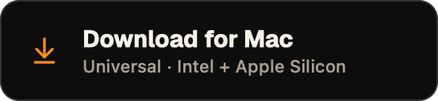
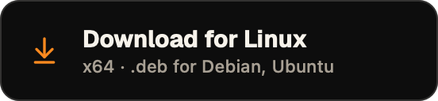
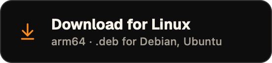
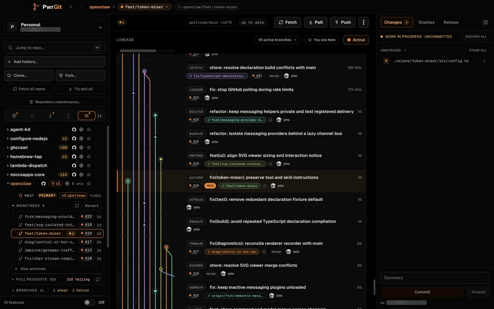
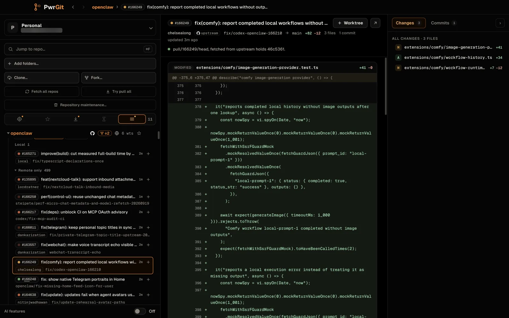
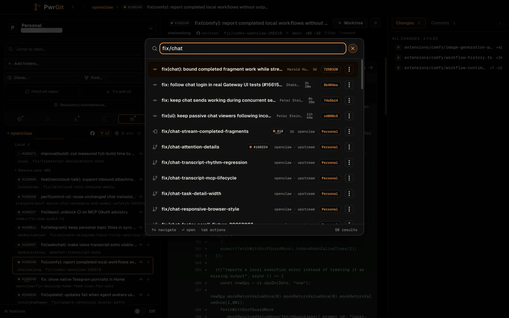
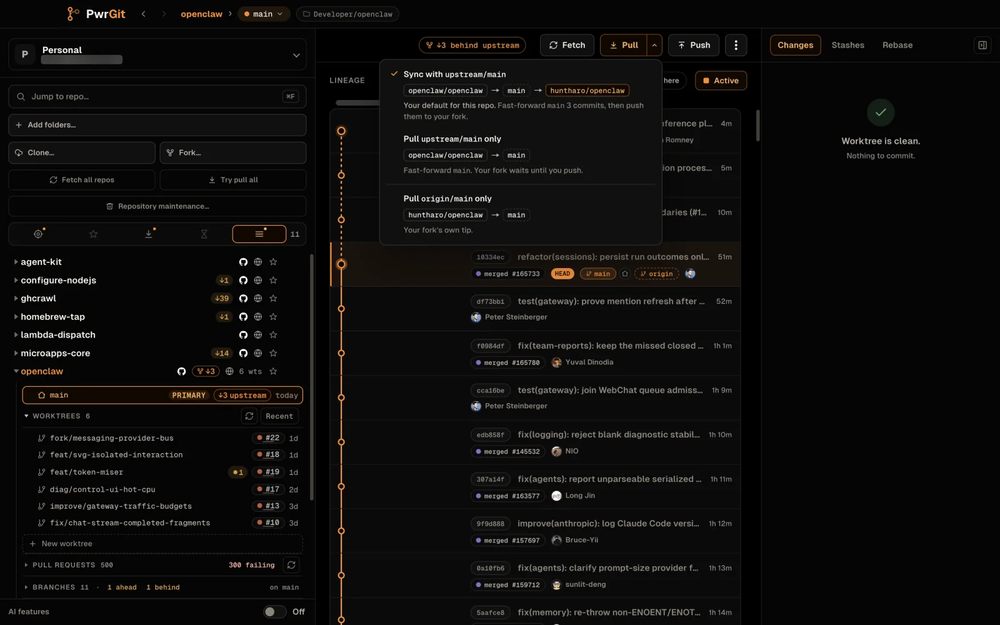
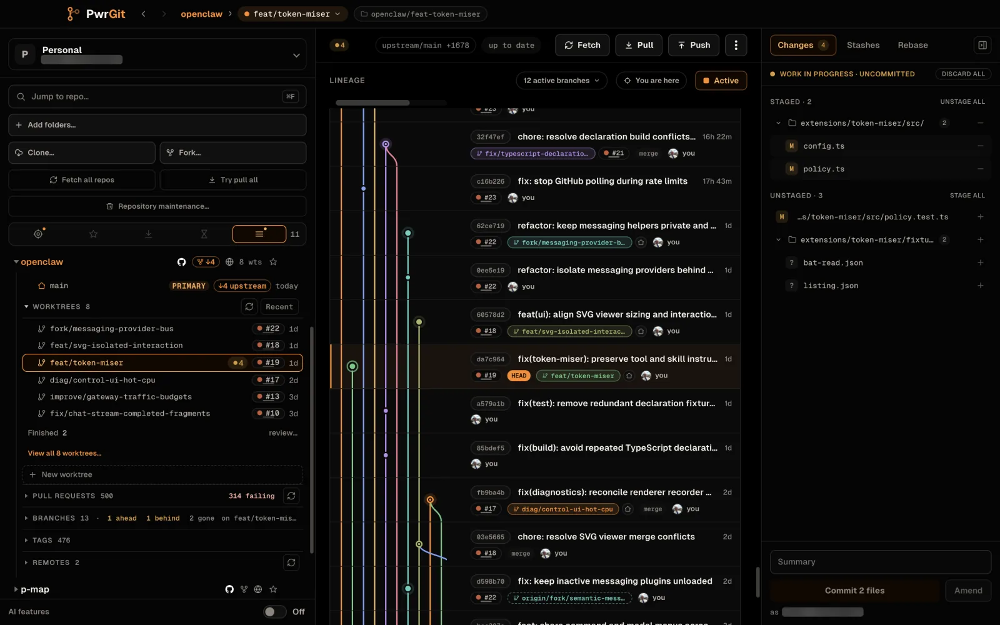

<div align="center">


<h1>PwrGit</h1>

<strong>Git for people working alongside an agent.</strong>

<p>A desktop Git client built around worktrees, forks, and pull requests.<br>
Every repository in one window. macOS, Windows, and Linux.</p>

<p>
  <a href="https://github.com/pwrdrvr/PwrGit/releases/latest/download/PwrGit-arm64.dmg"></a>
  <a href="https://github.com/pwrdrvr/PwrGit/releases/latest/download/PwrGit.dmg"></a>
  <a href="https://github.com/pwrdrvr/PwrGit/releases/latest/download/PwrGit.Setup.exe"></a>
</p>

<p>
  <a href="https://github.com/pwrdrvr/PwrGit/releases/latest/download/PwrGit-linux-x64.deb"></a>
  <a href="https://github.com/pwrdrvr/PwrGit/releases/latest/download/PwrGit-linux-arm64.deb"></a>
</p>

<sub>More Linux formats — x64: <a href="https://github.com/pwrdrvr/PwrGit/releases/latest/download/PwrGit-linux-x64.rpm">.rpm</a> · <a href="https://github.com/pwrdrvr/PwrGit/releases/latest/download/PwrGit-linux-x64.pacman">.pacman</a> · <a href="https://github.com/pwrdrvr/PwrGit/releases/latest/download/PwrGit-linux-x64.tar.gz">.tar.gz</a> &nbsp;·&nbsp; arm64: <a href="https://github.com/pwrdrvr/PwrGit/releases/latest/download/PwrGit-linux-arm64.rpm">.rpm</a> · <a href="https://github.com/pwrdrvr/PwrGit/releases/latest/download/PwrGit-linux-arm64.pacman">.pacman</a> · <a href="https://github.com/pwrdrvr/PwrGit/releases/latest/download/PwrGit-linux-arm64.tar.gz">.tar.gz</a></sub><br>
<sub>Homebrew: <code>brew install --cask pwrdrvr/tap/pwrgit</code></sub>

<p>
  <a href="https://docs.pwrgit.com"></a>
  <a href="https://pwrgit.com"></a>
  <a href="https://pwrdrvr.com/about"></a>
</p>

<sub>macOS 13 Ventura or newer · Windows 10 or newer · Linux x64 and arm64 · MIT</sub><br>
<sub>No account, no telemetry, no PwrGit server. Git ships inside the app.</sub>

<br><br>



</div>

## Why PwrGit

When something else is editing a branch, you want your own work in a
different directory and a clear view of what changed where. PwrGit is built
for that.

- **<kbd>Command+K</kbd> finds anything.** Repositories, worktrees, local and
  remote branches, and commits by message or SHA, across every profile.
  <kbd>Ctrl+K</kbd> on Windows and Linux.
- **Remote status without clicking around.** Incoming and outgoing counts for
  every visible repository, without selecting each checkout first.
- **Sync you can see.** Fetch, Pull, and Push each open a status card and keep
  a receipt of what they did. **Fetch all repos** and **Try pull all** run
  across the profile with a progress bar and a result summary. Pull is a
  fast-forward; a diverged branch gets a rebase-or-reset decision, not a
  surprise merge.
- **Forks handled properly.** Fork in place, **Switch origin to my fork**, see
  where a branch pulls from and pushes to, and repair tracking after a push to
  a repository you cannot write is denied.
- **Pull and merge requests in the sidebar.** Lists across your forge remotes,
  including requests you sent upstream from a fork. Open one in the in-app
  request view — files and commits — without checking it out, or fetch it into
  a new worktree.
- **GitHub and GitLab, through the CLIs you already use.** `gh` for GitHub,
  `glab` for gitlab.com and self-managed GitLab. PwrGit
  never asks for a password and stores no token of its own.
- **Worktrees are the model.** Repositories and their linked worktrees live
  together in the sidebar; create, pin, and remove them without losing which
  checkout owns which branch.
- **Agents can use it too.** A local, OAuth-protected MCP server lets an agent
  you approve find repositories and worktrees, read their status, and open
  them in PwrGit. Each agent gets a named session and a role you can revoke in
  **Settings → Local Agents**. [MCP guide](docs/mcp-server.md).
- **Git included.** Bundled Git and Git LFS, so nothing else needs to be
  installed. Prefer your own? **Settings → General → Git runtime** switches to
  an installed Git.

## A closer look

<table>
  <tr>
    <td width="50%"></td>
    <td width="50%"></td>
  </tr>
  <tr>
    <td><b>Pull requests in the app.</b> Files and commits, no checkout needed.</td>
    <td><b><kbd>Command+K</kbd>.</b> Repositories, worktrees, branches, commits.</td>
  </tr>
  <tr>
    <td width="50%"></td>
    <td width="50%"></td>
  </tr>
  <tr>
    <td><b>Forks that know their upstream.</b> Pull names both remotes and where each choice sends commits.</td>
    <td><b>Changes next to their context.</b> Stage files, hunks or lines, and commit in the selected worktree.</td>
  </tr>
</table>

## Install

| Platform | Download | Notes |
|---|---|---|
| macOS, Apple Silicon | [PwrGit-arm64.dmg](https://github.com/pwrdrvr/PwrGit/releases/latest/download/PwrGit-arm64.dmg) | M1 or newer. The smaller download. |
| macOS, Intel or not sure | [PwrGit.dmg](https://github.com/pwrdrvr/PwrGit/releases/latest/download/PwrGit.dmg) | Universal. On Apple Silicon it moves itself to the arm64 build on its next update. |
| macOS, Homebrew | `brew install --cask pwrdrvr/tap/pwrgit` | Picks the right build for your Mac. |
| Windows 10 / 11, x64 | [PwrGit.Setup.exe](https://github.com/pwrdrvr/PwrGit/releases/latest/download/PwrGit.Setup.exe) | Per-user installer, no administrator prompt. |
| Linux, x64 / arm64 | `.deb` · `.rpm` · `.pacman` · `.tar.gz` | Commands below. |

macOS builds are Developer ID-signed and Apple-notarized; macOS 13 Ventura or
newer. The Windows installer is signed through Azure Artifact Signing. There
is no Windows arm64 build yet.

**Linux** — swap `x64` for `arm64` on an ARM machine:

```bash
# Debian, Ubuntu
curl -fLO https://github.com/pwrdrvr/PwrGit/releases/latest/download/PwrGit-linux-x64.deb \
  && sudo apt install ./PwrGit-linux-x64.deb

# Fedora, RHEL, openSUSE (zypper also accepts the URL)
sudo dnf install https://github.com/pwrdrvr/PwrGit/releases/latest/download/PwrGit-linux-x64.rpm

# Arch
sudo pacman -U https://github.com/pwrdrvr/PwrGit/releases/latest/download/PwrGit-linux-x64.pacman
```

The `.tar.gz` is a portable build: extract it and run `pwrgit`. Each release
also carries `SHA256SUMS` files for Linux and Windows.

**Updates** come from GitHub Releases, on a Stable or Beta train with Latest
and Prerelease tracks (**Settings → Updates**). macOS and Windows update in
place. Linux `.deb`, `.rpm`, and `.pacman` installs check and download in-app
and ask for administrator authorization when you choose Restart; quitting
never installs. The `.tar.gz` is updated by replacing the extracted directory.

**Optional:** sign in to `gh` or `glab` for pull request, merge request, and
fork features. **Settings → Forges** shows what is connected and the command
to run when it is not.

Full walkthrough, first launch, and uninstall: [docs.pwrgit.com/install](https://docs.pwrgit.com/install/).

## AI features are opt-in

Off by default, and switched on per profile. When on, PwrGit can draft commit
and squash messages and propose a **Tidy** plan for selected commits. The work
runs through the Codex CLI you already have and are signed in to, with no
tools and no repository access — only the staged changes or selected commits
it is asked about. PwrGit holds no provider key.

A history plan is checked in an isolated copy and blocked if it would change
the final file tree; applying it stays your decision. Plain **Squash** and
**Reorder** need no model at all: they dry-run in a throwaway copy before you
approve them.

## Privacy

No account, no telemetry, no PwrGit server. Repository state stays in a local
SQLite database. Forge access goes through your own `gh` and `glab` sign-ins,
and AI features, when you turn them on, through your own agent CLI.

## Ways to help

- **[Star the repository](https://github.com/pwrdrvr/PwrGit)** — it is the
  main way anyone else finds PwrGit.
- **[Open an issue](https://github.com/pwrdrvr/PwrGit/issues)** for a bug or a
  rough edge. A repository shape that confuses the lineage graph is worth
  reporting even if nothing crashed.
- **Send a pull request.** Development setup, architecture, and the checks CI
  runs are in [CONTRIBUTING.md](CONTRIBUTING.md).
- **Report vulnerabilities privately** — see [SECURITY.md](SECURITY.md).

What changed in each release: [CHANGELOG.md](CHANGELOG.md).

## License

[MIT](LICENSE). Third-party dependency and embedded Git notices are in
[THIRD_PARTY_LICENSES](THIRD_PARTY_LICENSES) and ship with every release.

Created by [PwrDrvr LLC](https://pwrdrvr.com). Copyright © 2026 PwrDrvr LLC.
