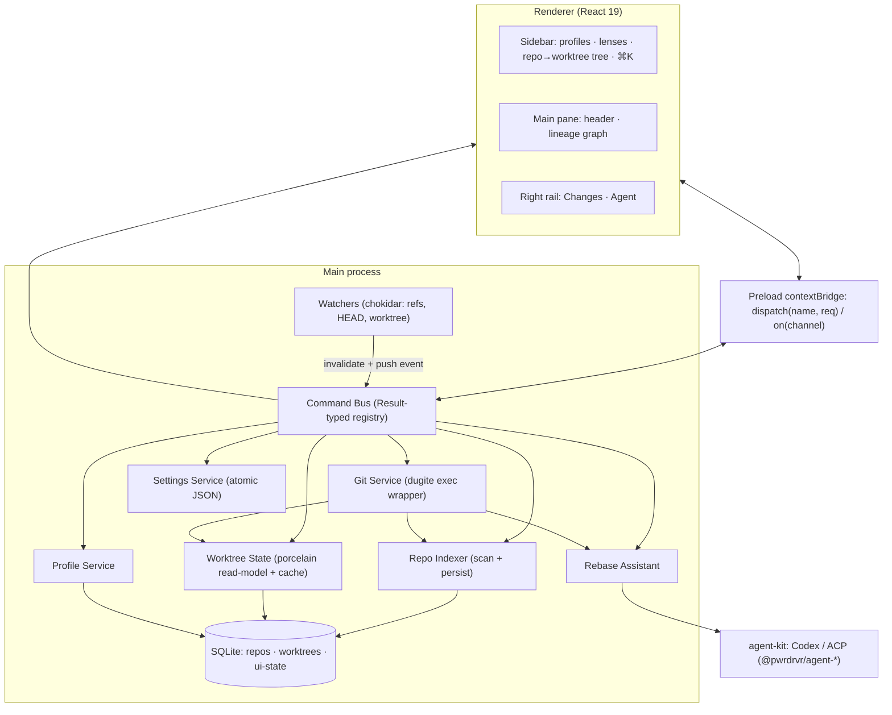
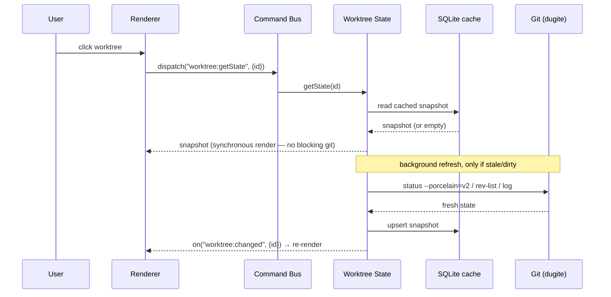

# feat: PwrGit — cross-platform desktop git client (Pwr family)

## Summary

Build **PwrGit**, a single-instance Electron desktop git client for macOS/Windows/Linux, by lifting the shared scaffolding from its siblings (`PwrSnap`, `PwrAgnt`) — pnpm monorepo, electron-vite/React 19 toolchain, `tokens.css` design system, PwrSnap's typed command-bus + `Result` IPC, and per-profile persistence — then adding the new core: a **dugite-backed git engine with a cached repo/worktree indexer** (SQLite + fs watchers) that makes switching among hundreds of repos and worktrees instant. The UI implements the imported design prototype exactly: profile switching with per-profile commit email, ⌘K cross-profile repo search, Recent/Pinned/Behind/All lenses, an expandable repo→worktree tree, a low-noise "Only me" lineage graph, a stage/commit flow, Fetch/Pull(=fetch+FF)/Push, and an agent-driven Squash/Reorder rebase assistant.

## Problem Frame

Managing many git repositories across multiple companies is poorly served by existing desktop clients: simple tools can't handle worktrees and lose track of hundreds of repos; heavier tools drown the user in branch noise and feel slow when navigating. The user works daily across multiple company contexts that share one GitHub identity but require different commit emails, keeps hundreds of repos, relies on worktrees, and wants a fast "fetch + fast-forward" pull. History-rewriting operations (interactive rebase, squash, reorder) are increasingly delegated to coding agents rather than performed by hand.

PwrGit exists to make that daily workflow fast and low-friction: find any repo instantly, see only the branches you actually work on by default, switch worktrees with zero perceptible lag, commit under the correct per-company identity automatically, and hand history edits to a linked agent that drafts a plan you approve. It is a sibling to `PwrSnap` and `PwrAgnt` and should reuse their architecture and styling rather than reinventing them.

The visual and interaction contract is already fixed by an imported, fully-working design prototype at `design/PwrGit.dc.html` (Claude Design "DC" format), which this plan treats as the authoritative UI spec.

---

## Requirements

### Platform & foundation

- R1. Cross-platform Electron desktop app (macOS/Windows/Linux) that mirrors the siblings' toolchain: pnpm monorepo (`apps/desktop` + `packages/shared`), electron-vite + Vite + React 19 + TypeScript, electron-builder packaging.
- R2. Typed command-bus IPC returning `Result<T, E>` across main/preload/renderer, adopted from PwrSnap; errors never throw across the process boundary.
- R3. Visual fidelity to `design/PwrGit.dc.html`: exact palette and tokens, Geist / Geist Mono fonts, three-pane warm-dark layout, custom titlebar.

### Profiles & identity

- R4. Single-instance app with in-app profile switching; switching changes the repo list, current selection, and active settings without spawning a second process. A second launch focuses the existing window.
- R5. Each profile carries a default commit email under one shared GitHub identity. Commits apply it as a non-mutating per-commit identity override; the Changes view surfaces "as {email}".
- R6. Per-profile persistence survives restart: pinned repos/worktrees, expand/sort/custom-order state, last selection, lens choice, and profile settings.

### Repos, worktrees & sidebar

- R7. Repo discovery by scanning each profile's configured root folders (bounded depth), plus manual add; the model scales to hundreds of repos without UI stalls.
- R8. ⌘K "jump to repo" overlay searches repos across all profiles with full keyboard navigation; opening a result from another profile switches to it.
- R9. Sidebar lenses Recent / Pinned / Behind / All with live counts; pinned repos sort first.
- R10. Expandable repo → worktree list: sort-cycle Pinned / A–Z / Active, drag-reorder persisted per repo, per-repo and per-worktree pin toggles, and dirty / ahead / behind badges.
- R11. Selecting a worktree renders its header, graph, and changes with no perceptible pause or reload (served from cache, invalidated by watchers).
- R12. Worktree lifecycle: create a new worktree under a PwrGit-managed dedicated worktree root, discover worktrees created elsewhere, and remove worktrees.
- R18. Worktree staleness signals — surfaces which of many worktrees are safe to prune. Each worktree exposes: clean vs dirty, commits behind its repo's **default branch**, whether it is already **merged into** the default branch, and **last-activity age**. A single-click **Stale** lens surfaces prunable worktrees (clean + merged-or-stale + old); the same signals show as subtle inline indicators on each worktree row. Visibility only in Milestone B; one-click removal is R12/U14.

### Git operations

- R13. Worktree header shows `repo › branch`, path, and a sync-status chip, with Fetch, Pull (fetch + fast-forward, guarded when not fast-forwardable), and Push. Buttons collapse to icons when the pane is narrow.
- R14. Lineage graph defaults to "Only me" — your commits plus the branch root — collapsing others behind a "N hidden · Show all branches" affordance; rendered as a per-row inline SVG rail with merge and branch-root markers, with multi-select of commits.
- R15. Changes view lists staged and unstaged files with M/A/D/? status, supports stage/unstage, a commit summary field, Commit, and Amend.

### Agent-assisted history editing

- R16. Selecting commits and choosing Squash or Reorder drives a linked agent (Codex/ACP via agent-kit) to draft a rebase plan the user approves; the rebase runs locally on the worktree and nothing is pushed until the user presses Push. Failures (e.g., conflicts) surface and abort cleanly.

### Packaging

- R17. Per-OS distributables with auto-update, mirroring the siblings' electron-builder + electron-updater configuration (signing/notarization hooks stubbed where certs are absent).

---

## Key Technical Decisions

- KTD1. **Git engine: `@shopify/dugite` (bundled git binary).** Matches GitHub Desktop; gives complete worktree support, credential-helper integration, and hooks with no dependence on the user's installed git version. Speed does not come from the binding — it comes from the read-layer and caching below (KTD2).
- KTD2. **Cached read-layer + fs watchers for instant switching.** Worktree state is derived from plumbing (`status --porcelain=v2`, `for-each-ref`, `rev-list --left-right --count` for ahead/behind, `cat-file --batch` / `log` for commit metadata), cached in SQLite keyed by worktree, and invalidated by `chokidar` watchers on the active worktree's working tree and each repo's `.git/refs` + `HEAD`. Selecting a worktree renders synchronously from cache and refreshes in the background — never a blocking git call on the click path (R11).
- KTD3. **Single-instance + in-app profiles** (diverges from PwrAgnt's separate-instance profiles). `app.requestSingleInstanceLock()`; a `second-instance` event focuses the window and optionally switches profile. Profiles are an in-app switch backed by per-profile SQLite state + settings, not OS processes (R4).
- KTD4. **Non-mutating commit identity.** Commits run with `git -c user.name=… -c user.email=…` per invocation; PwrGit never writes repo-local `user.email`. This keeps the shared GitHub identity intact while varying email per company (R5).
- KTD5. **Command-bus + `Result` IPC lifted from PwrSnap.** A single typed `dispatch(name, req)` gateway over `ipcRenderer.invoke`, one registration point in main, shared command registry in `packages/shared`. Transport-agnostic and minimizes the contextBridge surface (R2).
- KTD6. **Repo discovery: per-profile root-folder scan + manual add.** Each profile owns a set of root folders; a bounded-depth scan finds git repos under them (skipping nested/vendored `.git` inside `node_modules` etc.). A repo's profile is the profile whose roots contain it; manual add and manual reassignment override. Chosen over GitHub-Desktop-style manual-only to serve "hundreds of repos" (R7, per confirmed scope).
- KTD7. **Commit graph: per-row inline SVG, linear-first.** The design renders one SVG rail cell per commit row with merge curves and a branch-root dot — not a full multi-lane DAG. "Only me" default (KTD-adjacent to R14) keeps the common case linear and avoids lane assignment entirely; "Show all branches" uses a bounded lane algorithm added incrementally. Deliberately not a GitKraken-style always-on DAG.
- KTD8. **Worktree placement: PwrGit-managed dedicated root + external discovery.** New worktrees are created via `git worktree add` under a configurable per-OS worktree root (design shows `~/wt/<repo>/<branch>`); the indexer also lists pre-existing worktrees via `git worktree list --porcelain` regardless of location (R12, per confirmed scope).
- KTD9. **Agent integration via an agent-kit bindings adapter.** A small adapter (logger / openExternal / env) like PwrSnap's `apps/desktop/src/main/ai/agent-kit-bindings.ts` injects host services into `@pwrdrvr/agent-*`. The rebase assistant asks the agent to produce a rebase plan (an ordered pick/squash/reword list), applies it with `git rebase`, and gates apply + push behind explicit user approval (R16).
- KTD10. **Persistence: `better-sqlite3` + atomic settings + `safeStorage`.** SQLite holds the repo/worktree index and per-profile UI state; settings are atomic JSON writes (PwrSnap `desktop-settings-service` pattern); `safeStorage` covers any secrets. Git credentials are delegated to git's own credential helpers — PwrGit does not store tokens.

---

## High-Level Technical Design

### Process & service topology



### Instant worktree switch (read path)



### Rebase assistant (agent-gated)

```mermaid
sequenceDiagram
  participant R as Renderer (graph)
  participant B as Command Bus
  participant A as Rebase Assistant
  participant K as agent-kit (Codex/ACP)
  participant G as Git
  R->>B: dispatch("rebase:draft", {worktree, commitIds, op})
  B->>A: draft(op, commits)
  A->>K: prompt → ordered pick/squash/reword plan
  K-->>A: plan
  A-->>R: plan (preview in Agent tab — nothing applied)
  R->>B: dispatch("rebase:apply", {plan}) [explicit approval]
  B->>A: apply(plan)
  A->>G: git rebase (scripted sequence)
  alt success
    G-->>A: ok
    A-->>R: applied ✓ (local only; push still manual)
  else conflict/failure
    G-->>A: error
    A->>G: git rebase --abort
    A-->>R: failed — worktree restored
  end
```

---

## Output Structure

```text
PwrGit/
├─ package.json                      # workspace root (pnpm)
├─ pnpm-workspace.yaml
├─ tsconfig.base.json
├─ electron-builder.yml
├─ design/                           # (committed) imported prototype
├─ docs/plans/                       # this plan
├─ packages/
│  └─ shared/
│     ├─ package.json
│     └─ src/
│        ├─ index.ts
│        ├─ result.ts                # Result<T,E>
│        ├─ protocol.ts              # command registry (Req/Res per command)
│        └─ types.ts                 # Profile, Repo, Worktree, Commit, FileChange…
└─ apps/
   └─ desktop/
      ├─ package.json
      ├─ electron.vite.config.ts
      ├─ tsconfig.json
      ├─ e2e/                        # playwright smoke/e2e
      └─ src/
         ├─ main/
         │  ├─ index.ts              # boot, single-instance lock, lifecycle
         │  ├─ window.ts             # window factory + show-when-ready
         │  ├─ command-bus.ts        # typed registry + dispatch
         │  ├─ ipc.ts                # ipcMain bridge
         │  ├─ git/
         │  │  ├─ dugite.ts          # exec wrapper (Result)
         │  │  ├─ git-service.ts     # high-level ops
         │  │  ├─ repo-indexer.ts    # scan + persist
         │  │  ├─ worktree-state.ts  # porcelain read-model + cache
         │  │  └─ watchers.ts        # chokidar invalidation
         │  ├─ profiles/profile-service.ts
         │  ├─ settings/settings-service.ts
         │  ├─ persistence/db.ts + migrations/
         │  ├─ ai/agent-kit-bindings.ts + rebase-assistant.ts
         │  ├─ handlers/*.ts         # command handlers by domain
         │  └─ auto-updater.ts
         ├─ preload/index.ts
         └─ renderer/
            ├─ index.html
            └─ src/
               ├─ main.tsx  ·  App.tsx
               ├─ lib/pwrgit.ts (dispatch)  ·  useAppearance.ts
               ├─ styles/tokens.css · fonts.css · app.css
               ├─ state/            # store hooks / subscriptions
               └─ features/
                  ├─ sidebar/  (Sidebar, ProfileChip, LensFilter, RepoRow, WorktreeRow, RepoSwitcherOverlay)
                  ├─ graph/    (WorktreeHeader, LineageGraph, CommitRow, SelectionBar)
                  └─ rail/     (Rail, ChangesTab, CommitBox, AgentTab)
```

The per-unit **Files** lists are authoritative; this tree is the scope-level shape.

---

## Scope Boundaries

### Deferred for later (own follow-up work)

- Merge-conflict resolution UI, hunk-level / interactive staging, stash management, blame and file-history views.
- Submodule and Git LFS support.
- GitHub/host integration (PR lists, checks, review) and a full settings UI beyond what profiles need.
- Full light-theme parity beyond token definitions.

### Outside this product's identity

- Mimicking any specific existing client's look or feature set.
- A hand-driven interactive-rebase text editor — history rewriting is delegated to the agent (R16).
- Any server-side, cloud-sync, or hosting-provider backend.

### Deferred to follow-up work (plan-local sequencing)

- Full multi-lane DAG layout for "Show all branches" — U10 ships the linear + merge-marker case; richer lane assignment is a later increment (KTD7).
- Windows/Linux code-signing certificates and macOS notarization credentials — U17 wires the build config with signing hooks; real certs are provisioned separately.

---

## Implementation Units

Grouped into four milestones. Sibling code referenced as "patterns to follow" lives in the `PwrSnap` and `PwrAgnt` repos (paths given relative to those repos).

### Milestone A — Walking skeleton: boots, themed, sidebar lists real repos

### U1. Monorepo scaffold & toolchain lift

- Goal: A pnpm monorepo that boots an empty themed Electron window in dev and packages in prod, mirroring the siblings.
- Requirements: R1.
- Dependencies: none.
- Files: `package.json`, `pnpm-workspace.yaml`, `tsconfig.base.json`, `electron-builder.yml`, `apps/desktop/package.json`, `apps/desktop/electron.vite.config.ts`, `apps/desktop/tsconfig.json`, `apps/desktop/src/main/index.ts`, `apps/desktop/src/preload/index.ts`, `apps/desktop/src/renderer/index.html`, `apps/desktop/src/renderer/src/main.tsx`, `apps/desktop/src/renderer/src/App.tsx`, `apps/desktop/e2e/boot.spec.ts`.
- Approach: Copy the siblings' `electron.vite.config.ts` (main ESM / preload CJS / renderer React), electron-builder base, and dev script. Establish the single-instance lock and `second-instance` focus in `index.ts` (KTD3). Renderer boots a placeholder App shell.
- Patterns to follow: PwrSnap `apps/desktop/electron.vite.config.ts`, `apps/desktop/src/main/index.ts`; PwrAgnt `apps/desktop/src/main/window.ts` security hardening.
- Test scenarios: Covers R1. Playwright boot spec: app launches, a single BrowserWindow opens, `#root` mounts; second launch does not create a second window (single-instance lock holds). `Test expectation` for config files: none — scaffolding, verified by the boot spec.
- Verification: `pnpm dev` opens a window; `pnpm build` produces `out/`; boot spec passes.

### U2. Shared package: types, `Result`, command registry

- Goal: `@pwrgit/shared` exporting the domain types and the typed command registry both processes compile against.
- Requirements: R2.
- Dependencies: U1.
- Files: `packages/shared/package.json`, `packages/shared/src/index.ts`, `packages/shared/src/result.ts`, `packages/shared/src/types.ts`, `packages/shared/src/protocol.ts`, `packages/shared/src/protocol.test.ts`.
- Approach: Port PwrSnap's `Result<T,E>` and command-registry shape. Define domain types from the design's data model: `Profile { id, name, email, mono, kind }`, `Repo { id, name, path, profileId, pinned }`, `Worktree { id, repoId, branch, path, dirty, ahead, behind, pinned, order }`, `Commit { id, hash, subject, authorEmail, isMine, isMerge, isBase, time }`, `FileChange { path, status: 'M'|'A'|'D'|'?', staged }`. Command registry names Req/Res per command (`repo:list`, `worktree:getState`, `worktree:commit`, `remote:pull`, `rebase:draft`, …).
- Patterns to follow: PwrSnap `packages/shared/src/protocol.ts`, `result.ts`.
- Test scenarios: Covers R2. `Result` `ok`/`err` constructors and narrowing behave; a representative command's Req/Res types round-trip through a mock dispatch without `any` leaks (type-level + a runtime echo test).
- Verification: `pnpm -r typecheck` passes; both app processes import the registry.

### U3. Command-bus IPC plumbing

- Goal: End-to-end typed `dispatch` from renderer → preload → main with `Result` returns and a server→renderer event channel.
- Requirements: R2.
- Dependencies: U1, U2.
- Files: `apps/desktop/src/main/command-bus.ts`, `apps/desktop/src/main/ipc.ts`, `apps/desktop/src/preload/index.ts`, `apps/desktop/src/renderer/src/lib/pwrgit.ts`, `apps/desktop/src/main/command-bus.test.ts`.
- Approach: One `bus.register(name, handler)` map in main; `ipcMain.handle('cmd', (name, req) => bus.dispatch(...))`; preload exposes `pwrgitApi.dispatch(name, req)` and `on(channel, cb)`; renderer `dispatch()` / `dispatchOrThrow()` / `subscribe()` helpers. A `ping` command proves the loop.
- Patterns to follow: PwrSnap `apps/desktop/src/main/command-bus.ts`, `apps/desktop/src/main/ipc.ts`, `apps/desktop/src/preload/index.ts`, `apps/desktop/src/renderer/src/lib/pwrsnap.ts`.
- Test scenarios: Covers R2. Registered handler returns `ok` value to caller; handler returning `err` surfaces as a `Result` error (no throw across boundary); unknown command name yields a typed error; a server event delivered via `on` reaches a subscribed renderer callback and unsubscribes cleanly.
- Verification: renderer round-trips `ping`; an intentionally-failing handler returns an error `Result` rather than crashing.

### U4. Design tokens, fonts & three-pane app shell

- Goal: The exact visual shell from the prototype — tokens, fonts, titlebar, and the `320px │ 1fr │ 344px` layout with a collapsible rail.
- Requirements: R3.
- Dependencies: U1.
- Files: `apps/desktop/src/renderer/src/styles/tokens.css`, `apps/desktop/src/renderer/src/styles/fonts.css`, `apps/desktop/src/renderer/src/styles/app.css`, `apps/desktop/src/renderer/src/App.tsx`, `apps/desktop/src/renderer/src/lib/useAppearance.ts`.
- Approach: Author `tokens.css` using the design's exact palette (`--bg-app:#0a0908`, panels `#0e0d0b`/`#13110e`, input `#0d0c0a`, elevated `#1a1714`, accent `#e8743a`/bright `#fda984`, `--accent-on:#1a0d05`, text `#f5efe3`/`#b8b0a4`/`#8a8275`/`#5a544b`, borders `rgba(247,243,235,0.08/0.12/0.14)`, success `#6dba7e`/`#9ce5b3`, warn `#e8c890`, danger `#ffb0a1`, info `#6b9ad8`) in the siblings' token *structure*. Self-host Geist / Geist Mono via `@fontsource`. Build the titlebar (traffic-light spacing on macOS, `titleBarOverlay` on Windows) and the CSS-grid shell with rail collapse.
- Patterns to follow: PwrSnap `apps/desktop/src/renderer/src/styles/tokens.css`, `fonts.css`, `app.css`; `lib/useAppearance.ts`.
- Test scenarios: `Test expectation: none — styling/shell only.` Verified visually against `design/PwrGit.dc.html` and by a Playwright screenshot diff of the empty shell.
- Verification: shell matches the prototype's layout and colors at 1360×860; rail collapses/expands.

### U5. Profiles: model, registry, per-profile store & commit email

- Goal: Single-instance profiles with a switcher, each holding a default commit email and its own settings + UI-state store.
- Requirements: R4, R5, R6.
- Dependencies: U2, U3.
- Files: `apps/desktop/src/main/profiles/profile-service.ts`, `apps/desktop/src/main/settings/settings-service.ts`, `apps/desktop/src/main/persistence/db.ts`, `apps/desktop/src/main/persistence/migrations/0001_init.sql`, `apps/desktop/src/main/handlers/profile-handlers.ts`, `apps/desktop/src/renderer/src/features/sidebar/ProfileChip.tsx`, `apps/desktop/src/main/profiles/profile-service.test.ts`.
- Approach: A profiles registry (name, display, email, roots, last-used) plus a per-profile SQLite `state.db` and atomic settings JSON. Switching is an in-app command that swaps the active profile and emits `profile:changed`; the window is never re-spawned (KTD3). Commit email is stored per profile and consumed by the commit path (U12) as a `-c user.email` override (KTD4). Seed a first-run default profile from the current git config.
- Patterns to follow: PwrAgnt `apps/desktop/src/main/profile.ts`, `apps/desktop/src/main/ipc/profiles.ts` (adapt from multi-instance to in-app switch); PwrSnap `desktop-settings-service.ts` atomic writes.
- Test scenarios: Covers R4, R6. Creating a profile persists it and appears in `profile:list`; switching profiles changes the active profile and emits `profile:changed`; per-profile pinned/expand/last-selection state persists across a service restart and does not bleed between profiles; a profile's email is returned with the profile (R5 display path). Second-instance event focuses rather than duplicates.
- Verification: switching profiles in the UI updates the chip and (once U6/U7 land) the repo list; state survives restart.

### U6. Git engine + repo/worktree discovery & indexer (read-only)

- Goal: dugite wired in, with a bounded root-folder scan that discovers repos and their worktrees and persists an index the sidebar can read.
- Requirements: R7, R12 (discovery half).
- Dependencies: U3, U5.
- Files: `apps/desktop/src/main/git/dugite.ts`, `apps/desktop/src/main/git/git-service.ts`, `apps/desktop/src/main/git/repo-indexer.ts`, `apps/desktop/src/main/persistence/migrations/0002_repos.sql`, `apps/desktop/src/main/handlers/repo-handlers.ts`, `apps/desktop/src/main/git/repo-indexer.test.ts`.
- Approach: `dugite.ts` wraps `GitProcess.exec` returning `Result` (exit code, stdout, stderr) with per-repo cwd and env. `repo-indexer` scans each active profile's roots to a bounded depth, detecting repos by `.git` and skipping vendored trees (`node_modules`, nested repos under ignored paths); lists worktrees via `git worktree list --porcelain` (KTD8); upserts `repos` and `worktrees` rows. Manual add appends a root or a single repo. Exposes `repo:list` / `repo:add`.
- Patterns to follow: PwrSnap `apps/desktop/src/main/persistence/db.ts` + numbered migrations; `@shopify/dugite` `GitProcess` API; `git worktree list --porcelain` output format.
- Test scenarios: Covers R7. Scanning a fixture tree with two repos (one with an extra worktree) discovers exactly those repos and worktrees; a `node_modules/.git` fixture is skipped; a non-repo folder yields nothing; manual add of a single repo path outside the roots indexes it and assigns it to the active profile; re-scan is idempotent (no duplicate rows). Scan of a large fixture (hundreds of shallow entries) completes within a set time budget.
- Verification: sidebar (U7) shows the user's real repos grouped under the active profile.

### U7. Sidebar: profile chip/menu, lenses, repo→worktree tree, ⌘K overlay

- Goal: The full left pane from the prototype, wired to the indexer.
- Requirements: R8, R9, R10, R3.
- Dependencies: U4, U5, U6.
- Files: `apps/desktop/src/renderer/src/features/sidebar/Sidebar.tsx`, `LensFilter.tsx`, `RepoRow.tsx`, `WorktreeRow.tsx`, `RepoSwitcherOverlay.tsx`, `apps/desktop/src/renderer/src/state/useRepoTree.ts`, `apps/desktop/src/renderer/src/features/sidebar/Sidebar.test.tsx`.
- Approach: Port PwrAgnt's virtualized sidebar shape. Lenses Recent/Pinned/Behind/All with counts filter the list; pinned repos sort first. Repo rows expand to a worktrees section with sort-cycle (Pinned → A–Z → Active), HTML5 drag-reorder persisting a custom order per repo, and pin toggles. ⌘K opens the cross-profile search overlay (`repo:search`) with ↑/↓/↵/esc; picking a repo in another profile switches profiles first. Virtualize the repo list for hundreds of entries.
- Patterns to follow: PwrAgnt `apps/desktop/src/renderer/src/features/navigation/Sidebar.tsx`, `ThreadRow.tsx`, `RecentsList.tsx` (pinning, drag-reorder, virtualization). Design logic in `design/PwrGit.dc.html` `renderVals()` (`orderedWts`, lens filtering, drag handlers).
- Test scenarios: Covers R8, R9, R10. Each lens filters to the correct set and shows correct counts; pinning a repo moves it to the top and persists; expanding a repo lists its worktrees; sort-cycle reorders through Pinned/A–Z/Active; drag-reorder produces a persisted custom order that survives re-render; ⌘K filters across all profiles and picking a foreign-profile repo switches profile then selects it; a 300-repo list scrolls without rendering all rows.
- Verification: matches the prototype's sidebar behavior against the user's real repos.

---

### Milestone B — Git read: header, lineage graph, changes

### U8. Worktree state read-model + instant switch cache

- Goal: A cached, watcher-invalidated per-worktree state (dirty counts, ahead/behind, HEAD, last-activity) that renders synchronously on selection.
- Requirements: R11, R13 (sync-status data), R10 (badge data).
- Dependencies: U6.
- Files: `apps/desktop/src/main/git/worktree-state.ts`, `apps/desktop/src/main/git/watchers.ts`, `apps/desktop/src/main/persistence/migrations/0003_wt_state.sql`, `apps/desktop/src/main/handlers/worktree-handlers.ts`, `apps/desktop/src/main/git/worktree-state.test.ts`.
- Approach: Derive state from `status --porcelain=v2 --branch` (dirty + ahead/behind hints) and `rev-list --left-right --count @{u}...HEAD` when an upstream exists; also record last-commit time (`log -1 --format=%ct`) as `lastActivityAt`. Cache snapshots in SQLite. `worktree:getState` returns the cached snapshot immediately and schedules a background refresh; `chokidar` watches the active worktree's tree (debounced) and each repo's `.git/HEAD` + `.git/refs`, emitting `worktree:changed` to invalidate and re-read (KTD2). Watch lazily — active worktree deeply, others only at `.git` ref level — to bound handle usage. Staleness-vs-default-branch signals extend this model in U18.
- Patterns to follow: `git status --porcelain=v2` format; `chokidar` awaitWriteFinish/debounce; PwrSnap event-broadcast pattern.
- Test scenarios: Covers R11. First `getState` after a cold start returns within the synchronous budget from cache (empty→placeholder, then refresh event); editing a file in a watched worktree emits `worktree:changed` and the new dirty count appears; ahead/behind computed correctly against a fixture with an upstream 2 ahead / 3 behind; a worktree with no upstream reports no ahead/behind without error; switching rapidly between two worktrees never blocks on a git call.
- Verification: clicking between worktrees shows state with no perceptible pause; external edits reflect promptly.

### U18. Worktree staleness signals + Stale filter

- Goal: Surface which worktrees are safe to prune across many worktrees — clean, already merged into (or far behind) the repo's default branch, and old.
- Requirements: R18.
- Dependencies: U8 (extends the state read-model), U7 (sidebar surface).
- Files: `apps/desktop/src/main/git/worktree-state.ts` (extend), `apps/desktop/src/main/git/git-service.ts` (default-branch detect + merged/behind-default), `apps/desktop/src/main/persistence/migrations/0003_wt_state.sql` (extend), `apps/desktop/src/renderer/src/features/sidebar/repo-view.ts` (Stale filter), `apps/desktop/src/renderer/src/features/sidebar/WorktreeRow.tsx` (inline indicators), `apps/desktop/src/main/git/staleness.test.ts`, `apps/desktop/src/renderer/src/features/sidebar/repo-view.test.ts` (extend).
- Approach: Detect each repo's default branch once (`git symbolic-ref refs/remotes/origin/HEAD`, fallback to a local `main`/`master`). Per worktree, compute `behindDefault` (`rev-list --count <branch>..<default>`), `mergedIntoDefault` (`merge-base --is-ancestor <branch> <default>`), and reuse `lastActivityAt` from U8. Fold into the cached snapshot (same background-refresh + concurrency-bounded path as U8 — 156 worktrees means these git calls must be batched, cached, and lazy, never on the click path). A worktree is **stale/prunable** when clean AND (merged into default OR far-behind-with-no-unique-commits) AND `lastActivityAt` older than a threshold. Add a `Stale` lens to `repo-view` filtering to repos with prunable worktrees; render subtle inline indicators (merged · ↓N behind main · age) on each worktree row. Visibility only — removal is U14.
- Patterns to follow: U8's cached-snapshot + concurrency-bounded refresh; `merge-base --is-ancestor` exit-code semantics; the existing lens/`repo-view` structure from U7.
- Test scenarios: Covers R18. default-branch detection resolves origin/HEAD then falls back to main/master; `mergedIntoDefault` true for a branch whose tip is an ancestor of default, false otherwise; `behindDefault` counts default-only commits correctly; a clean+merged+old worktree is classified prunable while a dirty or ahead-with-unique-commits one is not; the `Stale` lens filters to repos containing a prunable worktree; inline indicators render merged/behind/age. Edge: a worktree on the default branch itself is never flagged stale.
- Verification: on a repo with a merged, untouched feature worktree, the Stale lens surfaces it and the row shows merged + age; active/dirty worktrees are excluded.

### U9. Worktree header + sync controls (Fetch/Pull/Push)

- Goal: The main-pane header with identity, path, sync chip, and the three sync buttons wired (Pull = fetch + fast-forward).
- Requirements: R13.
- Dependencies: U8.
- Files: `apps/desktop/src/renderer/src/features/graph/WorktreeHeader.tsx`, `apps/desktop/src/main/git/git-service.ts` (fetch/pull/push), `apps/desktop/src/main/handlers/remote-handlers.ts`, `apps/desktop/src/renderer/src/features/graph/WorktreeHeader.test.tsx`.
- Approach: Header shows `repo › branch` chip, path, and the sync-status chip driven by U8 (up-to-date / N behind / N ahead / fetching / fast-forwarded). Buttons: Fetch (`git fetch`), Pull (`git fetch` then `git merge --ff-only`; if not fast-forwardable, surface a guarded state rather than merging), Push (`git push`). Responsive collapse to icon-only under a width threshold (design `compact` logic). Full write behavior (progress, credentials) is finished in U13; this unit renders + calls.
- Patterns to follow: design `renderVals()` header + `onFetch`/`onPull` logic; `git merge --ff-only` semantics.
- Test scenarios: Covers R13. Sync chip reflects behind/ahead/up-to-date from state; Pull on a fast-forwardable branch advances HEAD and clears "behind"; Pull when not fast-forwardable does not merge and surfaces the guarded state; buttons collapse to icons below the width threshold; Fetch updates ahead/behind without moving HEAD.
- Verification: header matches the prototype; Pull fast-forwards a behind branch on a real repo.

### U10. Lineage graph with "Only me" default

- Goal: The commit graph — read log, default to your commits + branch root, render the per-row SVG rail, support multi-select.
- Requirements: R14.
- Dependencies: U8.
- Files: `apps/desktop/src/main/git/git-service.ts` (log read), `apps/desktop/src/main/handlers/graph-handlers.ts`, `apps/desktop/src/renderer/src/features/graph/LineageGraph.tsx`, `CommitRow.tsx`, `SelectionBar.tsx`, `apps/desktop/src/renderer/src/features/graph/LineageGraph.test.tsx`.
- Approach: Read commits via `git log` with a pretty format (hash, parents, author email, subject, committer time) for the current branch, bounded to a page. Mark `isMine` by matching the active profile's email; compute the branch root. "Only me" (default on) filters to mine + root, with a "N hidden · Show all branches" note toggling to the full list. Render each row's SVG rail (top/bottom lines, merge curve for 2-parent commits, branch-root dot) per the design; multi-select drives the selection action bar (Squash/Reorder/Ask agent) consumed by Milestone D. Full multi-lane DAG for "show all" is a later increment (KTD7 / deferred).
- Patterns to follow: design `commitsForSel()` + commit-row SVG markup and `dotFill`/`mergeColor` logic; `git log --parents` parsing.
- Test scenarios: Covers R14. Log parses hash/parents/author/subject/time for a fixture history; "Only me" hides commits whose author email ≠ active profile email but keeps the branch root, and the hidden count is correct; toggling "Show all branches" reveals them; a 2-parent commit renders the merge marker and gets a "merge" badge; selecting/deselecting commits updates the selection bar count; graph pages without loading entire history at once.
- Verification: matches the prototype's graph; "Only me" default meaningfully reduces rows on a noisy repo.

### U11. Changes tab (read side)

- Goal: The rail's Changes tab listing staged/unstaged files with status badges and the empty state.
- Requirements: R15 (read half).
- Dependencies: U8.
- Files: `apps/desktop/src/renderer/src/features/rail/Rail.tsx`, `ChangesTab.tsx`, `apps/desktop/src/main/handlers/changes-handlers.ts`, `apps/desktop/src/renderer/src/features/rail/ChangesTab.test.tsx`.
- Approach: `changes:list` returns staged + unstaged `FileChange[]` from `status --porcelain=v2`. Render the two sections with M/A/D/? status tiles (design's `statusStyle` colors), rtl-truncated paths, and the "Worktree is clean" empty state. The rail tab strip (Changes · Agent) and collapse control live here.
- Patterns to follow: design `CHANGES` model + `mkFile`/`statusStyle`; `status --porcelain=v2` XY code mapping.
- Test scenarios: Covers R15 (read). Modified/added/deleted/untracked files map to the correct status letter and color; staged vs unstaged split matches porcelain index/worktree columns; a clean worktree shows the empty state; the badge count on the tab equals the dirty count.
- Verification: file list matches `git status` on a real dirty worktree.

---

### Milestone C — Git write: stage/commit, remotes, worktree lifecycle

### U12. Staging & commit flow (per-profile identity)

- Goal: Stage/unstage files and commit (and amend) under the active profile's email via a non-mutating override.
- Requirements: R15 (write half), R5.
- Dependencies: U11, U5.
- Files: `apps/desktop/src/main/git/git-service.ts` (stage/unstage/commit/amend), `apps/desktop/src/main/handlers/changes-handlers.ts`, `apps/desktop/src/renderer/src/features/rail/CommitBox.tsx`, `apps/desktop/src/renderer/src/features/rail/ChangesTab.tsx`, `apps/desktop/src/main/git/commit.test.ts`.
- Approach: Stage/unstage via `git add` / `git restore --staged`. Commit runs `git -c user.name=<profile.name-or-git-default> -c user.email=<profile.email> commit -m <summary>`; never writes repo config (KTD4). Amend uses `--amend`. Optimistic UI updates then reconciles on the `worktree:changed` event. Commit button enabled only with a non-empty summary and ≥1 staged file (design logic); footer shows "as {email}".
- Patterns to follow: design commit box (`commitBtnStyle`, `commitLabel`, `onCommit`); git `-c` override.
- Test scenarios: Covers R15 (write), R5. Staging then committing produces a commit whose author/committer email equals the active profile email and whose `git config user.email` in the repo is unchanged; unstaging removes a file from the next commit; amend rewrites the last commit's message; committing with an empty summary is blocked; switching profiles changes the email used by the next commit. Integration: commit triggers a `worktree:changed` refresh that clears the Changes list.
- Verification: a commit on a real repo lands under the profile email without mutating repo config.

### U13. Remotes: Fetch / Pull (fetch+FF) / Push with progress & credentials

- Goal: Finish remote operations with progress feedback, credential-helper delegation, and error surfacing.
- Requirements: R13.
- Dependencies: U9.
- Files: `apps/desktop/src/main/git/git-service.ts` (remote ops), `apps/desktop/src/main/handlers/remote-handlers.ts`, `apps/desktop/src/renderer/src/features/graph/WorktreeHeader.tsx`, `apps/desktop/src/main/git/remote.test.ts`.
- Approach: Run fetch/pull/push through dugite with git's credential helpers (no token storage, KTD10). Emit progress/sync events (`fetching` → `fast-forwarded` / `up to date`) consumed by the header chip. Pull is fetch + `merge --ff-only`; non-FF returns a typed error surfaced as the guarded state. Push reports rejected (non-fast-forward) distinctly. A toast confirms success (design's toast).
- Patterns to follow: design `onFetch`/`onPull`/`onPush` transitions + toast; git credential helper flow.
- Test scenarios: Covers R13. Fetch against a fixture remote updates refs and emits the sync events; Pull fast-forwards and shows "fast-forwarded"; non-FF Pull returns a guarded error (no merge commit created); Push to a writable fixture remote succeeds; a rejected push surfaces a distinct error; a missing-credential path returns a typed error rather than hanging.
- Verification: against a local fixture remote, all three operations behave and the header reflects each transition.

### U14. Worktree lifecycle & drag-order persistence

- Goal: Create/remove worktrees (dedicated root) and persist the sidebar's custom worktree order.
- Requirements: R12, R10 (order persistence).
- Dependencies: U6, U7.
- Files: `apps/desktop/src/main/git/git-service.ts` (worktree add/remove), `apps/desktop/src/main/handlers/worktree-handlers.ts`, `apps/desktop/src/renderer/src/features/sidebar/WorktreeRow.tsx`, `apps/desktop/src/main/persistence/migrations/0004_wt_order.sql`, `apps/desktop/src/main/git/worktree-lifecycle.test.ts`.
- Approach: "New worktree" prompts for a branch (new or existing) and runs `git worktree add <root>/<repo>/<branch-dashed> <branch>` under the configurable worktree root (KTD8), then indexes it. Remove runs `git worktree remove` with a dirty-worktree guard. Custom drag order persists to SQLite per repo and feeds `orderedWts` (design). Adding/removing updates the index and emits an event.
- Patterns to follow: design `onNewWorktree`, drag `onDrop`/`wtOrder`; `git worktree add`/`remove`/`prune`.
- Test scenarios: Covers R12. Creating a worktree for a new branch adds it under the worktree root and it appears in the sidebar; creating for an existing branch checks it out in a new worktree; removing a clean worktree succeeds and drops it from the index; removing a dirty worktree is guarded; a pruned/externally-deleted worktree is reconciled on re-index; a persisted custom order survives restart and overrides the sort-cycle until re-cycled.
- Verification: worktrees created in PwrGit appear and are switchable; order persists.

---

### Milestone D — Agent rebase assistant + packaging

### U15. agent-kit bindings & session plumbing

- Goal: agent-kit wired through a host bindings adapter with Codex/ACP discovery, ready to drive from main.
- Requirements: R16 (foundation).
- Dependencies: U3, U5.
- Files: `apps/desktop/src/main/ai/agent-kit-bindings.ts`, `apps/desktop/src/main/ai/agent-session.ts`, `apps/desktop/src/main/handlers/agent-handlers.ts`, `apps/desktop/src/main/ai/agent-kit-bindings.test.ts`, `apps/desktop/package.json` (add `@pwrdrvr/agent-*`, `@pwrdrvr/codex-discovery`).
- Approach: Port PwrSnap's bindings adapter — map electron-log → agent-kit `Logger`, `shell.openExternal` → `OpenExternal`, and a per-profile env (e.g. `CODEX_HOME`) resolver. Add discovery of an available Codex/ACP agent and a minimal session that can send a prompt and receive a structured response. No git actions yet.
- Patterns to follow: PwrSnap `apps/desktop/src/main/ai/agent-kit-bindings.ts`, `acp-agent-pool.ts`, `codexEnvForProfile`.
- Test scenarios: Covers R16 (foundation). The logger adapter forwards levels/fields; `openExternal` is invoked for a URL; env resolver returns a per-profile home; discovery reports availability (or a typed unavailable reason) without throwing. A stubbed session returns a structured reply. `Test expectation` for the dependency add: none.
- Verification: main can discover an agent and complete a trivial round-trip in dev.

### U16. Rebase assistant: draft → approve → apply (gated)

- Goal: Selected commits + Squash/Reorder → agent-drafted rebase plan the user approves → applied locally, with clean failure handling and no push.
- Requirements: R16.
- Dependencies: U10, U15.
- Files: `apps/desktop/src/main/ai/rebase-assistant.ts`, `apps/desktop/src/main/handlers/rebase-handlers.ts`, `apps/desktop/src/renderer/src/features/rail/AgentTab.tsx`, `apps/desktop/src/renderer/src/features/graph/SelectionBar.tsx`, `apps/desktop/src/main/ai/rebase-assistant.test.ts`.
- Approach: `rebase:draft` sends the selected commits + op to the agent and returns an ordered pick/squash/reword plan rendered in the Agent tab (nothing applied — design's "Proposed plan" with scan animation). `rebase:apply` (explicit approval) executes the plan via a scripted non-interactive `git rebase` on the worktree; on conflict/failure it runs `git rebase --abort` and reports failure with the worktree restored. Push stays manual. Guard: refuse when the worktree is dirty or commits span a merge in unsupported ways.
- Patterns to follow: design Agent tab (`agentPlan`, `onApplyRebase`, "Runs locally … nothing pushed"); non-interactive rebase via `GIT_SEQUENCE_EDITOR`/scripted todo.
- Test scenarios: Covers R16. Draft for a Squash of 3 commits returns a plan with one `pick` + two `squash`; draft for Reorder returns the commits oldest-first with no content change; applying a valid squash reduces commit count and preserves tree content; a plan that conflicts triggers `--abort` and restores the original HEAD (worktree unchanged); apply is refused on a dirty worktree; nothing is pushed by either command. Integration: after a successful apply, the graph re-reads and shows the rewritten history.
- Verification: on a real branch, a squash drafted by the agent applies locally and the graph updates; a forced conflict aborts cleanly.

### U17. Packaging & auto-update

- Goal: Per-OS distributables with electron-updater, matching the siblings.
- Requirements: R17.
- Dependencies: U1.
- Files: `electron-builder.yml`, `apps/desktop/src/main/auto-updater.ts`, `apps/desktop/package.json` (release scripts), `apps/desktop/src/main/index.ts` (updater wiring).
- Approach: Configure electron-builder targets (dmg/zip, nsis, AppImage/deb) with `better-sqlite3` and dugite unpacked/rebuilt for the Electron ABI; wire `electron-updater` (check on startup, notify, download, install-on-quit) as in the siblings. Signing/notarization hooks are present but gated on cert availability (deferred).
- Patterns to follow: PwrSnap/PwrAgnt `electron-builder` config, `apps/desktop/src/main/auto-updater.ts`, release scripts, native-module rebuild step.
- Test scenarios: `Test expectation: none — build/release config`, validated by a CI package smoke (app packages on each OS and launches). Auto-update logic covered by a unit test of the update-state reducer if one is factored out.
- Verification: `pnpm package` produces a launchable artifact per OS; updater checks in a staged channel.

---

## Risks & Dependencies

- **Native modules across ABIs.** `better-sqlite3` and dugite's bundled git must be rebuilt/unpacked for the Electron ABI on each OS. Mitigation: reuse the siblings' rebuild step and electron-builder `asarUnpack` config (U1, U17).
- **Watcher scale (hundreds of repos).** Watching every worktree deeply risks `EMFILE`/CPU cost. Mitigation (KTD2/U8): watch the active worktree deeply, watch only `.git/HEAD`+`refs` for others, debounce, and refresh non-active repos on focus rather than continuously.
- **"Behind" accuracy depends on fetch freshness.** ahead/behind is only as current as the last fetch. Mitigation: fetch on repo focus + manual Fetch; a periodic background-fetch cadence is an open question (below), not a blocker.
- **Rebase failure modes.** Agent-drafted rebases can conflict. Mitigation (U16): always run non-interactively with `--abort` on failure and a dirty-worktree guard; push remains manual.
- **agent-kit / Codex availability.** Discovery may find no agent on a given machine. Mitigation (U15): typed unavailable reason; the Agent tab degrades to an explanatory empty state.
- **Credential handling.** Remote ops rely on the user's git credential helper. PwrGit stores no tokens (KTD10); a missing helper surfaces a typed error (U13) rather than hanging.
- **Dependency:** local `@pwrdrvr/agent-*`, `@pwrdrvr/codex-discovery` packages (published from `~/pwrdrvr/agent-kit`); `@shopify/dugite`; `better-sqlite3`; `chokidar`; `@fontsource/geist-*`.

---

## Open Questions

- Background-fetch cadence for keeping the "Behind" lens accurate — default to fetch-on-focus + manual for v1; evaluate a periodic background fetch after Milestone B. (Impl-time; not blocking.)
- Default worktree-root path per OS (e.g., `~/wt` vs under `userData`) — pick during U14; configurable regardless.
- Depth of the "Show all branches" lane algorithm — U10 ships linear + merge markers; richer DAG deferred (KTD7).

---

## Sources / Research

- Design spec: `design/PwrGit.dc.html` (authoritative UI + interaction logic — `renderVals()`, `orderedWts`, `commitsForSel`, `CHANGES`).
- Sibling patterns (other repos): PwrSnap `apps/desktop/src/main/command-bus.ts`, `ipc.ts`, `preload/index.ts`, `renderer/src/styles/tokens.css`, `main/ai/agent-kit-bindings.ts`, `main/persistence/db.ts`, `main/settings/desktop-settings-service.ts`; PwrAgnt `apps/desktop/src/main/profile.ts`, `main/ipc/profiles.ts`, `renderer/src/features/navigation/Sidebar.tsx`, `ThreadRow.tsx`, `RecentsList.tsx`.
- agent-kit: `~/pwrdrvr/agent-kit` publishing `@pwrdrvr/agent-{acp,client,core,transport}`, `@pwrdrvr/agent-chat-react`, `@pwrdrvr/codex-discovery`, `@pwrdrvr/codex-app-server-protocol`.
- External: `@shopify/dugite` (`GitProcess.exec`); git plumbing (`status --porcelain=v2`, `for-each-ref`, `rev-list --left-right --count`, `worktree list --porcelain`, `merge --ff-only`, non-interactive `rebase`); `chokidar` watch tuning; `@fontsource/geist-sans` / `geist-mono`.
